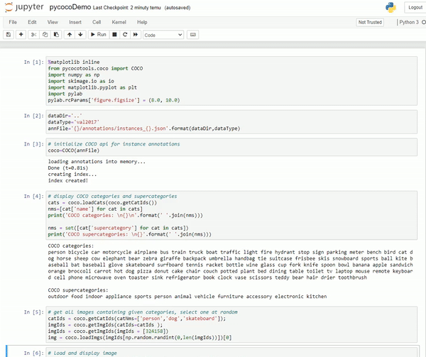

# AML Images Labeling VS Labeling In Opensource

### **Opis**

Projekt zakłada przegląd narzędzi umożliwiających oznaczanie obrazów. Szczególnej uwadze ma zostać poddany Azure Machine Learning Data Labeling. Omówione poniżej narzędzia, mają za zadanie ułatwienie przygotowania zbiorów danych, po przez ich oznaczenie. Zbiór taki może posłużyć następnie do dalszej analizy, zostać wykorzystany w kolejnym narzędziu lub może posłużyć jako zbiór danych dla uczenia sieci.

### Zespół - grupa nr 5 - *gamma*

- [Mateusz Mizio ](https://github.com/miziom ) - MM

- [Jarosław Królik](https://github.com/j-krolik) - JK

### Repozytorium

Repozytorium GitHub - [LINK](https://github.com/miziom/AI-Azure-Project-Image-Labeling)

### Wybrany stos technologiczny

***Serwis Azure***

- [Azure Machine Learning - Data Labeling](#Azure-Machine-Learning---Data-Labeling)
  - [Image Classification Multi-class](#Image-Classification-Multi-class)
  - [Image Classification Multi-label](#Image-Classification-Multi-label)
  - [Object Identyfication - Bounding Box](#Object-Identyfication---Bounding-Box)
  - [Instance Segmentation Polygon-Preview](#Instance-Segmentation-Polygon-Preview)

***Inne technologie:***

- [Cvat](#Cvat)
- [Label Studio](#Label-Studio)
- [Labelbox](#Labelbox)
- [Make-sens](#Make-sens)
- [Kili Technology](#Kili-Technology)
- [Yolo_label](#Yolo_label)
- [*Google Cloud AI Platform Data Labeling Service* - niedostępny](#Google-Cloud-AI-Platform-Data-Labeling-Service)

***Pochodzenie zbiorów danych***

- [ZBIÓR KWAITÓW](https://www.kaggle.com/alxmamaev/flowers-recognition)
- [Open Images Dataset V6](https://storage.googleapis.com/openimages/web/index.html)
- [Dog Api](https://dog.ceo/dog-api/breeds-list)
- [COCO](#Coco-Annotator)

### Kalendarz

|  Nr   |                        Działania                         |          Data           |    Kto?    | Check |
| :---: | :------------------------------------------------------: | :---------------------: | :--------: | :---: |
|   1   | Uzupełnienie stosu technologicznego - co będziemy badać? |       do 20.12.20       |   MM, JK   |   X   |
|   2   |     Przygotowanie zbioru danych potrzebnego do pracy     |       do 22.12.20       |   MM, JK   |   X   |
| **3** |                  **Przerwa Świąteczna**                  | **23.12.20 - 01.01.21** | **MM, JK** | **X** |
|   4   |             Analiza *Azure Machine Learning*             |       do 10.01.20       |     MM     |   X   |
|   5   |                   Analiza *Yolo_label*                   |       do 10.01.20       |     MM     |   X   |
|   6   |    Analiza *Awesome Data Labeling - Kili Technology*     |       do 13.01.20       |     MM     |   X   |
|   7   |                   Analiza *Make-sens*                    |       do 15.01.20       |     MM     |   X   |
|   8   |                      Analiza *CVAT*                      |       do 16.01.20       |     JK     |   X   |
|   9   |                  Analiza *Label Studio*                  |       do 16.01.20       |     JK     |   X   |
|  10   |                    Analiza *Labelbox*                    |       do 16.01.20       |     JK     |   X   |
### Mini wstęp teoretyczny

Proces tworzenia algorytmu do etykietowania zdjęć można podzielić na etapy:

* określenie zbioru zdjęć uczącego, ewentualnie walidacyjnego oraz testowego,
* nadanie etykiet zdjęciom, które jeszcze ich nie posiadają,
* trenowanie algorytmu,
* walidacja rezultatów.

Formaty adnotacji zdjęć:

* [CVAT](https://github.com/openvinotoolkit/cvat/blob/develop/cvat/apps/documentation/xml_format.md)
* [COCO](https://cocodataset.org/#format-data)
* [PASCAL VOD](http://host.robots.ox.ac.uk/pascal/VOC/voc2012/htmldoc/index.html)
* [YOLO](https://github.com/AlexeyAB/darknet#how-to-train-pascal-voc-data)
* [TF Detection API](https://github.com/tensorflow/models/blob/master/research/object_detection/g3doc/using_your_own_dataset.md)
* [MOT sqeuences](https://arxiv.org/pdf/1906.04567.pdf)
* [MOTS](https://www.vision.rwth-aachen.de/page/mots)
* [ImageNet](http://image-net.org/)
* [CamVid](https://mi.eng.cam.ac.uk/research/projects/VideoRec/CamVid/)
* [LabelMe](http://labelme.csail.mit.edu/Release3.0/)

### Narzędzia do etykietowania
1. #### Azure Machine Learning - Data Labeling

   Narzędzie to jest miejscem do tworzenia i monitorowania projektów etykietowania oraz zarządzania nimi po przez:

   - zarządzaniem danymi, etykietami, członkami zespołu
   - śledzenie postępów w projekcie
   - uruchamianie i zatrzymywanie projektu
   - przeglądanie oznaczonych danych
   - eksport oznaczonych danych

   Niezależnie od typu projektu (4 możliwości, opisane w dalszej części), należy spełnić pewne wymagania:

   - <u>wprowadzenie zbioru danych</u>

     Podajemy jego nazwę oraz możemy zamieścić jego opis. Wcześniej jednak musimy zdecydować jakiego typu będzie to zbiór. Zbiór może liczyć ***maksymalnie 500 000 obrazów***. Mamy dwie możliwości:

     - na podstawie plików lokalnych

       W ten sposób możemy prosto dodać pliki lokalne do utworzonego wcześniej lub na bieżąco Azure Blob Storage. Tworząc projekt AML mamy utworzony domyślny *workspaceblobstore*, do którego możemy dodać obrazy.

     - na podstawie magazynów danych - datastore (nie są wspierane magazyny danych SQL):

       - Azure Blob Storage
        - Azure File Share
       - Azure Data Lake Storage Gen1
        - Azure Data Lake Storage Gen2

   - <u>określenie "Incremental Refresh"</u> - *opcjonalne*

     Warto używać tej funkcji, jeżeli będziemy chcieli uzupełniać zbiór danych. Obrazy możemy dodawać za pomocą [Azure Storage Explorer](https://azure.microsoft.com/features/storage-explorer/). Po dodaniu obrazów do zbioru, zobaczymy, że dane są zamieszczone, jednak utworzony projekt *AML Data Labeling* nie będzie widział zamieszczonych nowych danych. Dlaczego? Dokumentacja przedstawia, że po włączeniu omawianej funkcji dodane dane będą pobierane do projektu raz dziennie. W praktyce dane aktualizowane są po 3-6h po dodaniu do zbioru danych.

   - <u>określenie etykiet dla poszczególnych klas</u>		

     Należy dodać etykiety, aby móc skategoryzować dane. Nazwy etykiet powinny być jednoznaczne, aby następnie osoby, które będą tagować zdjęcia nie miały wątpliwości co oznaczają. Należy dodać minimum 2 etykiety, aby stworzyć projekt. Etykiety można edytować po stworzeniu projektu, jednak należy pamiętać, że projekt musi wtedy być zatrzymany.

   - <u>dodanie instrukcji</u> - *opcjonalne*

     AML Data Labeling umożliwia pracę w grupie nad jednym zbiorem danych.

     

     W celu poinstruowania pozostałych pracowników projektu, można dodać instrukcje jak oznaczać obrazy. Można zrealizować to na dwa sposoby:

     - opisać w polu tekstowym

     - podać adres URL do zewnętrznej instrukcji - przydatne dal bardziej skomplikowanych instrukcji, albo w przypadku gdy taki zestaw zalecań został stworzony już wcześniej i jest opublikowany

     Instrukcje należy sformułować tak, aby rozwiewała wszelkie wątpliwości. Dobrze określić  etykietującym co powinni zrobić, jeśli żadna etykieta nie wydaje się odpowiednia, lub co powinni zrobić jeżeli kilka etykiet wydaje się być odpowiednimi. Co powinni zrobić, jeśli interesujący obiekt zostanie przycięty przez krawędź obrazu? Co powinni zrobić po przesłaniu etykiety, jeśli uważają, że popełnili błąd? Jeżeli mają definiować obwiednie, dobrze poinstruować w jaki sposób powinni ją tworzyć. Czy powinno znajdować się w całości wewnątrz obiektu, czy też na zewnątrz? Czy powinien być przycięty tak blisko, jak to możliwe, czy też dopuszczalny jest pewien prześwit? Jak oznaczyć przedmiot, który jest częściowo zakryty innym przedmiotem?

     Im lepiej zostanie stworzona instrukcja, tym mniej będzie wątpliwości, a co za tym idzie powstanie lepiej oznaczony zbiór danych.

   - <u>etykietowanie wspomagane przez **Machine Learning**</u> - *opcjonalne*

     Etykietowanie może być wspomagane przez Machine Learning. Umożliwia wyzwalanie modeli automatycznego uczenia maszynowego w celu przyspieszenia zadania etykietowania. Przy starcie projektu należy oznaczyć wiele obrazów. **Nie ma określonego progu**, po którym ML zostaje wyzwolony. Wszystko zależy od tego na jakim zbiorze danych tworzony jest projekt oraz od tego na ile poprawnie zostały oznaczone wcześniejsze obrazy.

     Z przeprowadzonych testów na zbiorach 1000, 2000 oraz ok 3000 obrazów zauważono, że próg przy poprawnym oraz dokładnym (w przypadku obwiedni) etykietowaniu wynosi między **300**, a **500** obrazów. Jednak pierwsze treningi wykonywane są już po ok 75-100 oznaczeniach. Jednak początkowe trening są wykonywane w ramach dostosowania do wstępnie wytrenowanego modelu. Etykietowanie wspomagane przez ML wykorzystuje **Transfer Learning**. Oznacza to, że wykorzystuje wstępnie wytrenowany model do szybkiego rozpoczęcia procesu szkolenia. Im większe podobieństwo klas użytych w projekcie do klas zdefiniowanych w modelu wstępnie wytrenowanym, tym szybsze rozpoczęcie wspomagania projektu przez ML.

     Ponieważ ostateczne etykiety nadal opierają się na danych wejściowych od osób etykietujących, technologia ta jest nazywana ***human in the loop labeling***.

     Aby móc skorzystać z ML należy użyć Maszyny Wirtualnej. W zależności od subskrypcji mamy dostęp do różnych klastrów. Maszyny możemy stworzyć podczas tworzenia projektu, lub wybrać wcześniej utworzone.

     Platforma AML udostępnia nam 2 typy maszyn wirtualnych, jeżeli chodzi o ich priorytet:

     - dedykowane - działają płynnie, bez przerwań

     - o niskim priorytecie - tańsze, ale nie gwarantują węzłów obliczeniowych, może okazać się, że praca zostanie przerwana lub rozpoczęta z dużym opóźnieniem

     Można korzystać tylko z maszyn wirtualnych z obsługą **GPU**, co korzystnie wpływa na szybkość obliczeń, szczególnie kiedy chodzi o przetwarzanie obrazów.

     Oprócz wyboru priorytetu, istnieje możliwość wyboru wielkości tworzonej maszyny. Obsługiwane rozmiary maszyn wirtualnych mogą być ograniczone w zależności od regionu. Microsoft publikuje listę maszyn oraz ich dostępności do poszczególnych regionów - [LINK](https://azure.microsoft.com/en-us/global-infrastructure/services/?products=virtual-machines&regions=all).

     W ramach używanej licencji studenckiej całkowity dostępny limit wynosi **6 rdzeni**.

     W przypadku wielkości można wybierać pomiędzy dwiema opcjami:

     - polecanymi

       Poniżej przedstawiono dostępne polecane VM dla rekomendowanych rozmiarów oraz pozostałych. Jak widać w zależności od możliwości Maszyny zmienia się jej cena pracy za godzinę.

       

       

     - wszystkimi opcjami

       Poniżej przedstawiono dostępne polecane VM dla rekomendowanych rozmiarów oraz pozostałych. Tu również możliwości maszyn przekładają się na ceny jednak są znacznie tańsze względem *polecanych*. Jeżeli jednak chcemy zaoszczędzić pieniądze lub nie zależy nam na ciągłości pracy Maszyny Wirtualnej, jest to odpowiednia opcja.

       

       

     Ze względu na ustalony limit 6 rdzeni, jak można zauważyć powyżej, wiele maszyn nie może zostać nam udostępnionych. Limity wprowadzane są ze względu na to, aby nie przekroczyć budżetu oraz przestrzegać ograniczeń pojemności platformy Azure. Ze względu na to, że konto Azure na subskrypcji studenta posiada $100 kredytów,  wiele VM zostało zablokowanych, ponieważ użycie ich spowodowałoby szybkie zużycie środków.

     W projektach mogą wystąpić **3 etapy** pracy:

     - **etap ręcznego oznaczanie**

       Początkowo należy ręcznie oznaczyć około 100 obrazów, aby pracę rozpoczął Machnie Learning. Po około 350-500 oznaczonych obrazach dostępne są kolejne etapy.

       

     - **etap klastrowania** - nie występuje w projektach wykrywania obiektów

       Po odpowiedniej ilości wyetykietowanych obrazów, model zaczyna grupować podobne obrazy. Sprawia to, że pogrupowane obrazy prezentowane są osobom etykietującym na ekranie na wybranych przez nich siatkach 4, 6 lub 9 obrazów. Umożliwia to znaczne przyspieszenie pracy, ponieważ oznaczający nie muszą poświęcać dodatkowego czasu na za wybieranie pomiędzy klasami.

       Po wstępnym wytrenowaniu modelu na danych oznaczonych ręcznie, model jest ograniczany do ostatniej w pełni połączonej warstwy. Obrazy bez etykiety są następnie przepuszczane przez wycięty/ograniczony model w procesie znanym jako cechowanie (featurization). To umieszcza każdy obraz w wielowymiarowej przestrzeni zdefiniowanej przez tę warstwę modelu. Obrazy, które są najbliższymi sąsiadami w przestrzeni, są używane do zadań grupowania.

       

     - **etap wstępnego oznaczania**

       Po przesłaniu wystarczającej liczby etykiet obrazów do przewidywania znaczników obrazów używany jest model klasyfikacji. Liczba ta jest indywidualna dla każdego projektu i zmienia się wraz z jego postępem. W tym etapie osoby etykietujące widzą już oznaczone zdjęcia, a w przypadku projektu wykrywania obiektów widzą przewidywane pola. Dzięki temu ich praca zawęża się do sprawdzania, czy algorytm oznaczył dobrze zdjęcia. Mogą nanosić wszelkie poprawki w przypadku błędnych oznaczeń lub jeżeli nie zostały oznaczone wszystkie obiekty, które powinny zostać oznaczone.

       Po przeszkoleniu modelu uczenia maszynowego na danych oznaczonych ręcznie, model jest oceniany na zestawie testowym ręcznie oznaczonych obrazów w celu określenia jego dokładności przy różnych progach ufności. Ten proces oceny służy do określenia progu ufności, powyżej którego model jest wystarczająco dokładny, aby pokazać wstępne etykiety. Model jest następnie oceniany na podstawie nieznakowanych danych. Obrazy z przewidywaniami bardziej wiarygodnymi niż ten próg są używane do wstępnego etykietowania.

       

     Kiedy etykietowanie wspomagane ML jest włączone, na ekranie podsumowującym projekt pokazywany jest szereg informacji. Mały pasek postępu pokazuje, kiedy nastąpi następny trening. Możemy podejrzeć ile zdjęć zostało przypisanych do danych etapów, jak rozkładają się poszczególne etykiety oraz ile oznaczeń wykonali poszczególni tagujący.

     Poniżej pokazane są 3 sekcje, które pokazują poszczególne eksperymenty:

     - *training*

       Odpowiada za naukę modelu przewidywania etykiet. Wykonywany jest wielokrotnie podczas trwania projektu. Dla każdego treningu wyznaczana jest dokładność jak i precyzja. Proces ten jest o tyle fascynujący, że reagują na bieżące postępy projektu. Jeżeli jesteśmy na etapie *wstępnego oznaczania* to nawet jeżeli nic nie będziemy zmieniać tylko potwierdzać przypuszczenia i oznaczenia modelu, to zatwierdzone przez nas wyniki będą  wykorzystane do kolejnych treningów. Wtedy występuje sytuacja, że model uczy się w pełni sam i poprawia swoje wyniki.

       

     - *validation*

       Określa, czy predykcja tego modelu będzie używana do wstępnego etykietowania pozycji. Podczas przeprowadzanych wielu próbach na różnych rodzajach projektów ani razu eksperyment nie został oznaczony jako wykonany, jednak przejście do kolejnych eksperymentów może sugerować, że jest to błąd wyświetlania informacji.

     - *inference*

       Odpowiada za przebieg prognozy dla nowych pozycji.

     - *featurization* - tylko dla projektów klasyfikacji obrazów

       Odpowiada za elementy klastrów. Umieszczane są obrazy w przestrzeni zdefiniowanej przez warstwę obciętego modelu. Obrazy, które są najbliższymi sąsiadami w przestrzeni, są używane do zadań grupowania.

     


     Narzędzie umożliwia utworzenie **4 rodzajów projektów**:
    
     
    
     - ##### **Image Classification Multi-class**
    
       Projekt, który umożliwia oznaczenie obrazu tylko jedną klasą z zestawu klas.
       Obejmuje wszystkie omówione wcześniej 3 etapy.
    
       
    
       W doświadczeniach przejście do 2 etapu następowało przy oznaczeniu około 400-450 obrazów. Po przejściu do etapy *klastrowania*, aby jak najszybciej osiągnąć etap *wstępnego oznaczania* wystarczyło oznaczyć 100-200 zgrupowanych obrazów i poczekać, aż ruszy kolejny trening. Wtedy to liczba zdjęć *wstępnie oznaczonych* ulega zwiększeniu, a kiedy my dodatkowo potwierdzimy poprawność oznaczeń, wpłynie to pozytywnie na wyniki kolejnych treningów.
    
       Wyniki można wyeksportować na dwa sposoby:
    
       - dataset
    
         Takie rozwiązanie może w łatwy sposób umożliwić użycie naszego zbioru w kolejnych serwisach.
    
         
    
       - coco
    
         Plik wynikowy jest w formacie wynikowym, gdzie na początku pliku mamy opisane nasz zbiór danych:
    
         
    
         Następnie zapisane są oznaczenia:
    
         
    
       - ***OCENA DZIAŁANIA - 5/5***
    
         AML Data Labeling w tym rodzaju projektu bardzo dobrze radzi sobie z przyporządkowywaniem obrazów do poszczególnych klas. Oznaczenie dużych zbiorów obrazów przebiega bardzo szybko i przyjemnie. Fascynującym aspektem jest to, że kiedy model wstępnie oznaczy nam obrazy a my go będziemy utwierdzać w jego predykcjach, nasza praca ograniczy się wyłącznie do klikania przycisku *PRZEŚLIJ*.
    
     - ##### **Image Classification Multi-label**
    
       Projekt ten umożliwia oznaczenie obrazów wieloma klasami z zestawu klas. Obejmuje wszystkie omówione wcześniej 3 etapy.
    
       Przejście do drugiego etapu wymaga oznaczenie standardowo około 400-450 zdjęć. Pierwsze treningi i propozycje grupowania obrazów zdają się działać na tyle źle, że ciężko odróżnić dobór zdjęć w etapie grupowania od zdjęć w etapie ręcznego oznaczania. Po oznaczeniu w sumie ok 900-1000 zdjęć, zaobserwowano faktyczne grupowanie obrazów. Początkowo na 6/9 obrazach można było wyszukać wspólną klasę jednak podpowiedzi modelu były bardzo nieintuicyjne. Po osiągnięciu 1200 oznaczonych obrazów, klastrowanie przebiegało falowo. Kilka siatek 9 obrazów z bardzo dobrze wyselekcjonowanymi zdjęciami, po czym wiele siatek ze średnio pogrupowanymi obrazami.
    
       
    
       Podczas testów nie udało się osiągnąć etapu *wstępnego oznaczania*. Może mieć to wiele przyczyn, zaczynając od niejasnego zbioru danych, kończąc na błędach w oznaczaniu lub niedokładnym oznaczaniem obrazów. Brak osiągnięcia tego etapu może być również skutkiem tego, że trenowane modele nie do końca dobrze radzą sobie z problemem oznaczanie obrazów wieloma klasami.  Dla jednej klasy (poprzedni rodzaj projektu) wychodzi to świetnie.
    
       Używano do 5 klas, co można uznać za średnią ilość.  Naturalnie najlepiej grupowane były te zdjęcia, których oznaczeń wcześniej wystąpiło najwięcej.
    
       Jak w poprzednim projekcie dane możemy otrzymać na 2 sposoby:
    
       - dataset
    
         
    
       - coco
    
         
    
         
    
         - ***OCENA DZIAŁANIA - 4/5***
    
           AML dla tego projektu jest na pewno ułatwieniem w procesie oznaczania zdjęć. Ogromny wpływ na otrzymane wyniki ma zbiór danych oraz jego wstępne oznaczanie. Warto używać go dla projektów, gdzie trzeba oznaczyć tysiące zdjęć. W przypadku o ilości mniejszej niż 1000, nie ma sensu używać tego rodzaju projektu.
    
     - ##### **Object Identyfication - Bounding Box**
    
       Umożliwia przypisywania klasy oraz zdefiniowania obwiedni, czyli określenia dokładnego położenia reprezentanta danej klasy.
    
       Po początkowym ręcznym oznaczeniu 400-500 zdjęć, następuje przejście do etapu *wstępnego oznaczania*. W tym podejściu nie ma etapu klastrowania. ML oznacza elementy i radzi sobie z tym bardzo dobrze.
    
       
    
       Naturalnie im lepiej zostaną oznaczone początkowe obrazy, tym w lepszy sposób tagowane są kolejne oraz tym szybciej można osiągnąć etap *wstępnego oznaczania*.
    
       Przeprowadzono test w którym nie oznaczano wszystkich elementów oraz nie robione tego w sposób dokładny. Sieć jednak była w stanie nauczyć się na podstawie tych wykonanych czynności i sama oznaczać zdjęcia w znacznie lepszy sposób, niż oznaczone ręcznie obrazy.
    
       Standardowo dane możemy otrzymać na 2 sposoby:
    
       - dataset
    
         
    
       - coco
    
         Na początku są definiowane obrazy. W dalszej części zapisane są oznaczenia. Zapisana jest powierzchnia względem całego obrazu w skali 0-1. W *"bbox"* zapisana jest lokalizacja obiektu w postaci znormalizowanej:
    
         ```
         "bbox": [
         	topX,
         	topY,
         	szerokość obiektu,
         	wysokość obiektu
         ]
         ```
    
         
    
         
    
         - ***OCENA DZIAŁANIA - 5/5***
    
           Narzędzie to w znaczny sposób poprawia pracę nad oznaczaniem zbioru. Jeżeli mamy odpowiednie fundusze oraz mały zespół oraz zbiór liczący tysiące elementów, możemy poświęcić część zbioru. Możemy oznaczyć początkowe obrazy sposobem mniej dokładnym oraz oznaczać tylko elementy wyraźne i znaczące. Modelowi wystarczy to do treningu, po czym sam będzie proponował dokładniejsze oznaczenia.
    
       - ##### **Instance Segmentation Polygon-Preview**
    
         Jest to format który nie wspiera Azure Machine Learning. Umożliwia oznaczanie obrazów w o wile bardziej dokładny sposób. Jednak brak ML, który by wspierał proces sprawia, że jest to tylko porządny edytor do oznaczania zdjęć.
    
         
    
         Standardowe uzyskanie wyników:
    
         - dataset
    
           
    
         - coco
    
           Oprócz oznaczenia ogólnego po przez *bbox*, mamy oznaczoną segmentację. Zapisane są tam wszystkie wierzchołki, które tworzą dany obszar po przez pary wartości X oraz Y.
    
           
    
           

   - ***OCENA DZIAŁANIA - 3.5/5***

     Jest to dobry edytor, który co najważniejsze umożliwia pracę w zespole nad jednym zbiorze danych. Ze względu na brak wsparcia AML, nie można ocenić go lepiej. Samo korzystanie z narzędzia jest bardzo intuicyjne.

------

   - ***<u>WNIOSKI</u>***
     - Niezależnie od rodzaju projektu, sposób oznaczania obrazów jest bardzo intuicyjny i nie wymaga długiego szkolenia, żeby opanować pracę w tym środowisku.
     - W początkowych etapach projektu, pośpiech nie jest wskazany. Należy umożliwiać inicjacje kolejnych treningów i oczekiwać ich wyników, ponieważ dzięki takiemu działaniu jesteśmy w stanie szybciej osiągać satysfakcjonujące nas efekty uczenia
     - Sens użycia narzędzia jest wtedy, kiedy pracujemy na względnie dużych zbiorach, liczących wiele tysięcy zdjęć. Praca na zbiorach poniżej 500 obraz kompletnie nie ma sensu.
     - Ze względu na to, że podczas treningu Maszyna Wirtualna pracuje tyle ile potrzebuje, trudno jest określić koszty jakie zostaną poniesione. W przeprowadzanych doświadczeniach zauważono, że znaczne wzrosty długości trwania poszczególnych treningów są dłuższe im wyższej iteracji jest to trening, ale nie dzieje się tak zawsze. Znając cenę pracy za godzinę, możemy tylko szacować. Im większy zbiór, tym należy spodziewać się dłuższej pracy maszyny.
     - Im bardziej zrównoważony zbiór (porównywalne ilości przedstawicieli z każdej klasy), tym cały proces przebiega bardziej płynnie i szybko
     -  Po stworzeniu projektu, jesteśmy w stanie dodatkowo rozdzielić proces **trenowania** oraz **prognozowania** na dwie oddzielne maszyny wirtualna - domyślnie pracują na tej samej, wyznaczonej przy tworzeniu projektu.
     -  Etap *grupowania* dla projektu multi-labeling powinien zostać wyeliminowany, tak jak w projekcie Bounding Box
   - <u>***ZALETY***</u>

     - przyspieszenie procesu oznaczania zbioru obrazów
     - możliwość pracy w grupie na jednym zbiorze - określanie dostępów dla współużytkowników
     - zarządzanie projektem i śledzenie postępów
     - dynamiczne powiększanie zbioru wejściowego
     - wsparcie Azure Machine Learning
     - model dostosowuję się ciągle do naszego projektu, a nie jest wykorzystaniem gotowego modelu
     - Multi-class Image Classification oraz Object Identyfication
     - niski próg wejścia
     - prosty i szybki eksport wyników
     - obsługa zbiorów do 500 000 obrazów
     - możliwość dodawania dodatkowych etykiet po stworzeniu projektu
   - <u>***WADY***</u>

     - trudno w pełni określić koszty, można "tylko" szacować
     - Multi-label Image Classificatication oraz Instance Segmentation
     - nie ma możliwości powrotu do raz pominiętego obrazu

2. #### CVAT

CVAT (Computer Vison Annotation Tool)

* jest bezpłatnym, open source narzędziem do adnotacji obrazu oraz  wideo
* prowadzony przez firmę Intel.
* Projekt ten został utworzony przez profesjonalny zespół do adnotacji danych oraz UI/UX projektantów. W połączeniu z bogatą ofertą skrótów klawiszowych pozwala na proces szybkiej adnotacji danych.
* udostępniony w oparciu o licencję MIT

#####  Wspierane formaty

Więcej informacji można znaleźć [tutaj](https://github.com/openvinotoolkit/cvat/blob/develop/cvat/apps/dataset_manager/formats/README.md#formats)

| Format                                                       | Import | Export |
| ------------------------------------------------------------ | ------ | ------ |
| [CVAT for images](cvat/apps/documentation/xml_format.md#annotation) | X      | X      |
| [CVAT for a video](cvat/apps/documentation/xml_format.md#interpolation) | X      | X      |
| [Datumaro](https://github.com/openvinotoolkit/datumaro)      |        | X      |
| [PASCAL VOC](http://host.robots.ox.ac.uk/pascal/VOC/)        | X      | X      |
| Segmentation masks from [PASCAL VOC](http://host.robots.ox.ac.uk/pascal/VOC/) | X      | X      |
| [YOLO](https://pjreddie.com/darknet/yolo/)                   | X      | X      |
| [MS COCO Object Detection](http://cocodataset.org/#format-data) | X      | X      |
| [TFrecord](https://www.tensorflow.org/tutorials/load_data/tf_records) | X      | X      |
| [MOT](https://motchallenge.net/)                             | X      | X      |
| [LabelMe 3.0](http://labelme.csail.mit.edu/Release3.0)       | X      | X      |
| [ImageNet](http://www.image-net.org)                         | X      | X      |
| [CamVid](http://mi.eng.cam.ac.uk/research/projects/VideoRec/CamVid/) | X      | X      |

##### Instalacja

Interfejs użytkownika jest oparty o interfejs webowy.  Do dyspozycji mamy dwie możliwości:

* wersja demo - [cvat.org](https://cvat.org/)
  ograniczenia:
  * max 10 zdań może posiadać jeden użytkownik
  * max 500MB danych
* lokalna instancja, oparta o kontener - [tutorial](https://github.com/openvinotoolkit/cvat/blob/develop/cvat/apps/documentation/installation.md)

Do dyspozycji również mamy REST API, którego dokumentacje można znaleźć pod adresem `<cvat_origin>/api/swagger>`, np. https://cvat.org/api/swagger/

Sam proces utworzenia projektu oraz zadań, jest bardzo prosty. Co widać na poniższym gifie.


**Klasyfikacja obrazów**

CVAT wspiera klasyfikacje obrazów, w tym celu powstał tryb *tag annotation*. W tym trybie przeglądamy pojedyncze zdjęcia oraz klasyfikujemy za pomocą klawiszy klawiatury od `0` do `9` (każda liczba ma przypisaną inną etykietę). Aby przejść do kolejnego zdjęcia naciskamy `f` lub zaznaczamy opcję *Automatically go to the next frame*.


##### Segmentacja obrazów

Czynność tą można wykonywać myszką oraz klawiaturą za pomocą skrótów klawiszowych. Aby poznać skróty klawiszowe należy nacisnąć F1.

* standardowe dodawanie etykiet

  * bounding box
    

  * polygon - manual

    


  * polygon - AI tool - segmentacja pół-autoatyczna


Wspierane jest również szybka segmentacja podobnych do siebie obrazów, za pomocą zarówno bounding-box jak i polygon.


##### Deep learning

Dodatkowo wspierane jest wykorzystywanie pewnych modeli głębokiego uczenia. Algorytmy te zostały przedstawione w tabeli poniżej. 

Warto również wspomnieć, że istnieje środowisko [Openpanel](https://github.com/onepanelio/core), które łączy [CVAT](https://github.com/opencv/cvat) z [JupyterLab](https://github.com/jupyterlab/jupyterlab) oraz [NNI (Neural Network Intelligence)](https://github.com/microsoft/nni)

| Name                                                                                                    | Type       | Framework  | CPU | GPU |
| ------------------------------------------------------------------------------------------------------- | ---------- | ---------- | --- | --- |
| [Deep Extreme Cut](/serverless/openvino/dextr/nuclio)                                                   | interactor | OpenVINO   | X   |
| [Faster RCNN](/serverless/tensorflow/faster_rcnn_inception_v2_coco/nuclio)                              | detector   | TensorFlow | X   | X   |
| [Mask RCNN](/serverless/openvino/omz/public/mask_rcnn_inception_resnet_v2_atrous_coco/nuclio)           | detector   | OpenVINO   | X   |
| [YOLO v3](/serverless/openvino/omz/public/yolo-v3-tf/nuclio)                                            | detector   | OpenVINO   | X   |
| [Text detection v4](/serverless/openvino/omz/intel/text-detection-0004/nuclio)                          | detector   | OpenVINO   | X   |
| [Semantic segmentation for ADAS](/serverless/openvino/omz/intel/semantic-segmentation-adas-0001/nuclio) | detector   | OpenVINO   | X   |
| [Mask RCNN](/serverless/tensorflow/matterport/mask_rcnn/nuclio)                                         | detector   | TensorFlow | X   |
| [Object reidentification](/serverless/openvino/omz/intel/person-reidentification-retail-300/nuclio)     | reid       | OpenVINO   | X   |

##### REST API

CVAT posiada REST API, którego dokumentację można znaleźć [tutaj](https://cvat.org/api/swagger/). W przypadku lokalnej instancji, dokumentacje można znaleźć pod adresem `<cvat_origin>/api/swagger` (domyślnie: `localhost:8080/api/swagger`).

##### Kooperacja

Możliwa jest kooperacja poprzez przypisywanie etykietowania oraz recenzowania innym użytkownikom.


- ***OCENA DZIAŁANIA - 4.25/5***

     Jest to dobry edytor, posiadający przyjazny interfejs oraz przydatne skróty klawiszowe. Możliwe jest również kooperacja. Wspiera również deep learning (nie było testowane).

------

   - ***<u>WNIOSKI</u>***
     - Łatwy w obsłudze, nawet dla osób "niewtajemniczonych"
     - Posiada tryby emitowania, które nie posiadają inne programu
     - Bardzo rozbudowany deep learning (nie testowany)
     - Środowisko współpracuje z innymi podobnymi środowiskami - obsługa wielu rozszerzeń, współpraca z *Openpanel*
   - <u>***ZALETY***</u>

     - bezpłatne, ciągle rozwijane narzędzie
     - obsługa wielu formatów
     - posiada przydatną, niespotykaną funkcję przenoszenia konturu (podczas segmentacji) na kolejne zdjęcie (znaczne przyspieszenie pracy)
     - możliwość współpracy wielu osób
     - dostępna wersja demo, aby móc oszacować przydatność narzędzia
     - zarządzanie projektem i śledzenie postępów
   - <u>***WADY***</u>

     - w przypadku chęci kooperacji bez własnej docer'owej instacji, należy liczyć się z pewnymi ograniczeniami
     - brak grupowej klasyfikacji z wykorzystaniem AI, którą posiada Azure Machine Learning - Data Labeling
     - słabo rozwinięta kontrybucja, do etykietowania danego zbioru, można przypisać jedną osobę

3. #### Yolo_label

Proste narzędzie do oznaczenia zbioru danych. Pliki wyjściowe są w formacie .txt, a oznaczenia są w formacie YOLO. Oznacza to, że każda linia w pliku opisuje pojedynczy oznaczony obiek:

```
NUMER_KLASY X_MIN Y_MIN SZEROKOŚĆ WYSOKOŚĆ
```

Wartości określające pozycje zdjęcia występują w postaci znormalizowanej - z przedziału <0, 1>. Pliki wyjściowe otrzymują nazwę pokrywającą się z nazwą oznaczanego zdjęcia.

W celu skorzystania z programu, należy pobrać go ([LINK](https://drive.google.com/file/d/1lanO8SyY2QlbVCbOR0LlwQjQYbhoteTd/view)), a następnie uruchomić *YoloLabel.exe*. Po uruchomieniu należy wybrać folder, w którym powinny znajdować się **tylko i wyłącznie** zdjęcia do oznaczenia. Następnie należy wczytać plik z nazwami poszczególnych klas, w postaci pliki *.txt* lub *.names*. Wewnątrz niego w pojedynczych liniach powinny znajdować się nazwy klas:

> daisy
>
> rose
>
> sunflower

Następnie należy oznaczać poszczególne zdjęcia:


W folderze ze zdjęciami tworzone są pliki z oznaczeniami:


Struktura pliku dla oznaczonego zdjęcia wygląda następująco:

> 0 0.252392 0.540074 0.431818 0.535142
>
> 0 0.739234 0.471640 0.504785 0.585697

- *<u>**OCENA DZIAŁANIA - 2/5**</u>*

  Jest to proste narzędzie jednak ograniczone. Pozwala na jeden format wynikowy (zgodny z YOLO) oraz nie pozwala na pracę grupową.

- ***<u>ZALETY</u>***

  - Intuicyjna obsługa
  - prosta instalacja
  - darmowa aplikacja
  - niski próg wejścia

- ***<u>WADY</u>***

  - brak wsparcia Machine Learning
  - brak możliwości pracy w grupie


4. #### Make-sens

   Jest to bezpłatne narzędzie [online](https://www.makesense.ai/), które umożliwia oznaczanie zdjęć. Dzięki zastosowaniu przeglądarki nie wymaga  skomplikowanej instalacji - wystarczy wejść na stronę i gotowe. Istnieje również możliwość pobrania aplikacji i uruchomienia jej lokalnie. Potrzebne pliki oraz instrukcję jak to zrobić, można znaleźć na [GitHub](https://github.com/SkalskiP/make-sense). Aplikacja została napisana w języku TypeScript i bazuje na duecie React / Redux.

   W celu skrócenia czasu, jaki trzeba poświęcić na opisywanie zdjęć, narzędzie to umożliwia korzystanie ze sztucznej inteligencji.  W chwili obecnej aplikacja może uzyskać wspracie:

   - [SSD model](https://arxiv.org/abs/1512.02325)

     Wstępnie przeszkolony na zbiorze danych COCO, który wykona część pracy przy rysowaniu ramek na zdjęciach, a także (w niektórych przypadkach) zasugeruje etykietę. Pokazane jest to poniżej, w oznaczaniu obiektów prostokątnych.

   - [PoseNet model](https://www.tensorflow.org/lite/models/pose_estimation/overview)

     To model widzenia, który można wykorzystać do oszacowania pozy osoby na obrazie poprzez oszacowanie, gdzie znajdują się kluczowe stawy ciała. Działanie ukazane jest poniżej, przy oznaczeniu punktów.

   Producent deklaruje, że w przyszłości planuje także dodać m.in. modele klasyfikujące zdjęcia, wykrywające charakterystyczne cechy twarzy, a także całe twarze.

   Aplikacja umożliwia dwa rodzaje projektów

   - <u>oznaczanie obrazów</u>

     Umożliwia oznaczanie obrazów klasami - od jednego do wielu klas dla jednego obrazu.

     

   - <u>detekcja obiektów</u>

     Udostępnia szereg możliwości. Użytkownik może oznaczać obraz na kilka sposobów:

     - **prostokąty (wsparcie AI)**

       Użytkownika może oznaczać zdjęcia po przez określenie obszaru (prostokąt) oraz przypisaniu mu etykiety. Wsparcie AI może ułatwić pracę, lecz nie zawsze. Dla obraz z dobrze *czytelnym/widzianym* obiektem AI wspomaga proces bardzo dobrze. Gorzej w przypadku, kiedy obiekty nie są czytelne lub obraz jest słabej jakości. Pomimo, że zwykle algorytm nie trafia z wybranymi przez nas etykietami, realizuję pracę związaną z oznaczeniem lokalizacji obiektów na obrazie.

       

     - **wielokąt**

       Użytkownik może zdefiniować szereg punktów, które stają się wierzchołkami wielokąta.

       

     - **punkty (wsparcie AI)**

       Istnieje również możliwość oznaczania obrazu punktami. Dzięki temu możemy oznaczyć zbiory, które pomogą nam zbadać postawy ciała. W tym przypadku pomoże nam AI.

       

     - **linie**

       

     Oznaczone zdjęcia można wyeksportować do wielu formatów w zależności od projektu:

     |                | CSV  | YOLO | VOC XML | VGG JSON | COCO JSON | PIXEL MASK |
     | :------------: | :--: | :--: | :-----: | :------: | :-------: | :--------: |
     |   **Punkt**    |  ✓   |  ✗   |    ☐    |    ☐     |     ☐     |     ✗      |
     |   **Linia**    |  ✓   |  ✗   |    ✗    |    ✗     |     ✗     |     ✗      |
     | **Prostokąt**  |  ✓   |  ✓   |    ✓    |    ☐     |     ☐     |     ✗      |
     |  **Wielokąt**  |  ☐   |  ✗   |    ☐    |    ✓     |     ✓     |     ☐      |
     | **Oznaczanie** |  ✓   |  ✗   |    ✗    |    ✗     |     ✗     |     ✗      |

     Legenda:

     - ✓ - wspierany format
     - ☐ - nie wspierany format
     - ✗ - format nie ma sensu dla danego typu etykiety

     

   - *<u>**OCENA - 4.5/5**</u>*

     Doskonale sprawdza się w małych projektach, znacznie ułatwiając i przyspieszając proces przygotowania zbioru danych. Wsparcie AI oraz deklaracje producenta sprawiają, że atrakcyjność produktu znacznie wzrasta. Do kompletu brakuje możliwości pracy w grupie, chociaż trzeba zauważyć, że producent poleca aplikacje do małych projektów, gdzie praca grupowa nie jest tak wymagana.

   - ***<u>ZALETY</u>***

     - bezpłatna
     - online
     - doskonały dla małych projektów
     - SSD model oraz PoseNet model
     - nie trzeba przesyłać obrazów na serwer

   - ***<u>WADY</u>***

     - SSD dla gorszej jakości zdjęć bardziej utrudnia, niż pomaga w realizacji projektu
     - brak możliwości pracy w grupie

5. #### Kili Technology

   *[Kili Technology](https://kili-technology.com/)* to narzędzie do adnotacji obrazu, tekstu i głosu, zaprojektowane, aby pomóc firmom w szybszym wdrażaniu aplikacji uczenia maszynowego.

   Podobnie jak w *AML Data Labeling* podczas tworzenia projektu wybieramy jego typ, definiujemy zbiór danych oraz definiujemy jego opis. Możemy również zdefiniować instrukcje, która pozwoli osobom osobom etykietującym na poprawne i efektywne oznaczanie oraz zdefiniuje działania w przypadku braku pomysłu na oznaczenia zdjęcia.

   Poniżej przedstawiono wyexportowany plik z damymi JSON, który jest tworzony dla formatu Google API:

   ```
   [
       {
           "content": "https://cloud.kili-technology.com/api/label/v2/files?id=709e1512-a3cd-47aa-ba77-653eeda315dc",
           "externalId": "5547758_eea9edfd54_n.jpg",
           "id": "ckjvguag611890k9ods1yhwnz",
           "jsonMetadata": {},
           "labels": [
               {
                   "author": {
                       "email": "mmizio1997mmizii@gmail.com",
                       "id": "ckjvczqg301j80j96ax5nda8w",
                       "name": "mmizio1997mmizii@gmail.com"
                   },
                   "createdAt": "2021-01-13T13:38:20.359Z",
                   "isLatestLabelForUser": false,
                   "jsonResponse": {
                       "JOB_0": {
                           "annotations": [
                               {
                                   "boundingPoly": [
                                       {
                                           "normalizedVertices": [
                                               {
                                                   "x": 0,
                                                   "y": 1
                                               },
                                               {
                                                   "x": 0,
                                                   "y": 0.22185366745783675
                                               },
                                               {
                                                   "x": 0.7795453452522922,
                                                   "y": 0.22185366745783675
                                               },
                                               {
                                                   "x": 0.7795453452522922,
                                                   "y": 1
                                               }
                                           ]
                                       }
                                   ],
                                   "categories": [
                                       {
                                           "confidence": 100,
                                           "name": "DAISY"
                                       }
                                   ],
                                   "mid": "2021011314380570-11249",
                                   "score": null,
                                   "type": "rectangle"
                               }
                           ]
                       }
                   },
                   "labelType": "DEFAULT",
                   "modelName": null,
                   "skipped": false
               },
   ```

   Dzięki dobrze zaprojektowanym widokom, sama praca osób etykietujących jest znacznie szybsza, niż w przypadku prostych narzędzi. Aby ją przyspieszyć, można skorzystać z **integracji z Machine Learning**. Aby to zrobić, należy posiadać swój wytrenowany model. W celu połączenia się z narzędziem, naelży wygenerować klucz API, który umożliwi integracje naszej maszyny ze środowiskiem Kili. W celu ułatwienia procesu integracji twórcy narzędzia stworzyli pomoce w postaci skryptów w google colab. Pod [linkiem](https://colab.research.google.com/github/kili-technology/kili-playground/blob/master/recipes/transfer_learning_with_yolo.ipynb) możemy zobaczyć skrypt, który można zaadoptować do własnych celów i modeli. Serwis Kili Technology umożliwia obsługę narzędzia z poziomu Python. W [dokumentacji](https://cloud.kili-technology.com/docs/introduction/introduction-to-kili-technology.html) można sprawdzić nie tylko to w jaki sposób korzystać z samego narzędzie z poziomu serwisu, ale również poradniki i przykładowe skrypty do adaptacji, które umożliwiają integracji np. z Machine Learninig.

   Naturalnie, jeżeli ktoś ma za zadanie oznaczyć nieduży zbiór, to nie skorzysta ze wsparcia ML, ponieważ dla wytrenowania modelu również potrzeba oznaczyć inny zbiór oraz poświęcić czas i zasoby na wytrenowanie go. Jeżeli jednak zadaniem jest oznaczenie wiele tysięcy zdjęć, wtedy warto rozważyć to rozwiązanie. Warto podkreślić, że próg wejścia do tej integracji jest względnie wysoki, ponieważ trzeba wiedzieć jakich sieci oraz w jaki sposób użyć. Jednak po stworzeniu takiego pytania nasuwa się pytanie: **po co korzystać z tego serwisu, kiedy mam własny model, który robi to bez jego pośrednictwa?**

   Dla oznaczania obrazów umożliwia utworzenie 5 rodzajów projektów:

   - **Image Classification (single-class)**

     Umożliwia określenie zestawu klas oraz przyporządkowywanie jednej klasy do jednego zdjęcia.

     

   - **Image Classification (multi-class)**

     Umożliwia określenie zestawu klas oraz przyporządkowywanie wielu klas do jednego zdjęcia.

     

   - **Image Object Detection (bounding box)**

     Umożliwia oznaczanie konkretnych obszarów na obrazie oraz zdefiniowanymi klasami. Obszar jest w kształcie prostokąta.

     

   - **Image Object Detection (polygon)**

     Umożliwia oznaczanie konkretnych obszarów na obrazie oraz zdefiniowanymi klasami. Obszar tworzą oznaczone punkty, które stają się wierzchołkami utworzonej figury.

     

   - **Image Object Detection (semantic)**

     Umożliwia oznaczanie konkretnych obszarów na obrazie oraz zdefiniowanymi klasami. Obszar jest definiowany w sposób ciągły, co pozwala na szybkie

     

   - *<u>**OCENA - 4/5**</u>*

     Narzędzie w prosty sposób może przyspieszyć proces etykietowania danych. Umożliwia wsparcie Machine Learningu, jednak musimy posiadać własny model i dołączyć go do procesu w celu wstępnego dodania adnotacji. Intuicyjne interfejsy oraz możliwość pracy w grupie nad zbiorem

   - ***<u>ZALETY</u>***

     - łatwe dodanie danych po przez "przeciągnij i upuść"
     - monitorowanie jakości produkcji za pomocą wskaźników
     - export danych do pliku JSON dla formatu Google API
     - możliwość pracy w grupach oraz zarządzanie uczestnikami - role i obowiązki
     - darmowe narzędzie
   - ***<u>WADY</u>***
     - konieczność posiadania własnego modelu w celu wsparci ML
     - w przypadku użycia ML - względnie wysoki próg wejścia
     - przy jednokrotnym ładowanie do zbioru możemy dodawać do 500 obrazów, ale dany zbiór możemy poszerzać wielokrotnie

6. #### Label Studio

*[Label Studio](https://labelstud.io/)* to środowisko służące do etykietowania danych takich jak: obrazy, dźwięki, tekst, szeregi czasowe czy kombinacje tych danych. Środowisko te udostępniane jest jako open source, istnieje również wersja enterprise pod nazwą [Heartex](https://heartex.com/product). Repozytorium label studio można znaleźć [tutaj](https://github.com/heartexlabs/label-studio). Firmami, które wykorzystują te narzędzie jest między innymi FB, IMB, Nvidia, Intel.

##### Instalacja

Interfejs użytkownika jest oparty o interfejs webowy.  Server możemy postawić za pomocą:

* pip
* Anacoda
* docker
* docker-compose

##### Oznaczanie zdjęć

To co jest nietypowe oraz warte uwagi to definiowanie trybu adnotacji. W przeciwieństwie do większości narzędzi w których wybieramy tryb oznaczania zdjęć, w tym środowisku tryb definiujemy sobie za pomocą XML. Dokumentacje XML można znaleźć [tutaj](https://labelstud.io/tags/image.html)

* [BrushLabels](https://labelstud.io/tags/brushlabels.html)
```xml
<View>
  <BrushLabels name="labels" toName="image">
    <Label value="Car" />
  </BrushLabels>
  <Image name="image" value="https://cdn.pixabay.com/photo/2016/11/23/15/32/architecture-1853552_960_720.jpg" />
</View>
```


```json
[
    {
        "original_width": 960,
        "original_height": 637,
        "value": {
            "format": "rle",
            "rle": [
                0,
                37,
                83,
                0,
                ...
```

* [Choice](https://labelstud.io/tags/choice.html)

```xml
<View>
  <Choices name="gender" toName="image" choice="single">
    <Choice value="Male" />
    <Choice value="Female" />
  </Choices>
  <Image name="image" value="https://cdn.pixabay.com/photo/2015/09/02/13/24/girl-919048_960_720.jpg" />
</View>
```


```json
[
    {
        "value": {
            "choices": [
                "Female"
            ]
        },
        "id": "x4RUIf_Q7F",
        "from_name": "gender",
        "to_name": "image",
        "type": "choices"
    }
]
```

* [KeyPoint](https://labelstud.io/tags/keypoint.html)

```xml
<View>
  <KeyPoint name="people" toName="img-1" />
  <Image name="img-1" value="https://cdn.pixabay.com/photo/2016/11/23/15/32/architecture-1853552_960_720.jpg" />
</View>
```


```json
[
    {
        "original_width": 960,
        "original_height": 637,
        "image_rotation": 0,
        "value": {
            "x": 43.190661478599225,
            "y": 80.93841642228739,
            "width": 0.19455252918287938
        },
        "id": "ApXcQ6yUuM",
        "from_name": "people",
        "to_name": "img-1",
        "type": "keypoint"
    },
    {
        "original_width": 960,
        "original_height": 637,
        "image_rotation": 0,
        "value": {
            "x": 46.88715953307393,
            "y": 82.40469208211144,
            "width": 0.19455252918287938
        },
        "id": "4czOhtNZG2",
        "from_name": "people",
        "to_name": "img-1",
        "type": "keypoint"
    },
    ...
]
```

* [KeyPointLabels ](https://labelstud.io/tags/keypointlabels.html)

```xml
<View>
  <KeyPointLabels name="kp-1" toName="img-1">
    <Label value="people" />
    <Label value="car" />
  </KeyPointLabels>
  <Image name="img-1" value="https://cdn.pixabay.com/photo/2016/11/23/15/32/architecture-1853552_960_720.jpg" />
</View>
```


```json
[
    {
        "original_width": 960,
        "original_height": 637,
        "image_rotation": 0,
        "value": {
            "x": 26.070038910505836,
            "y": 86.80351906158357,
            "width": 0.19455252918287938,
            "keypointlabels": [
                "car"
            ]
        },
        "id": "WlrNxr1tv0",
        "from_name": "kp-1",
        "to_name": "img-1",
        "type": "keypointlabels"
    },
    {
        "original_width": 960,
        "original_height": 637,
        "image_rotation": 0,
        "value": {
            "x": 60.89494163424124,
            "y": 80.35190615835778,
            "width": 0.19455252918287938,
            "keypointlabels": [
                "car"
            ]
        },
        "id": "Whck5dlnKC",
        "from_name": "kp-1",
        "to_name": "img-1",
        "type": "keypointlabels"
    },
    ...
]
```

* [PolygonLabels](https://labelstud.io/tags/polygonlabels.html)

```xml
<View>
  <PolygonLabels name="lables" toName="img-1">
    <Label value="Men" />
    <Label value="Women" />
  </PolygonLabels>
  <Image name="img-1" value="https://cdn.pixabay.com/photo/2015/09/02/13/24/girl-919048_960_720.jpg" />
</View>
```


```json
[
    {
        "value": {
            "points": [
                [
                    14.84375,
                    98.82697947214076
                ],
                [
                    16.796875,
                    92.08211143695014
			   ],
			   ...
```

* [RectangleLabels](https://labelstud.io/tags/rectanglelabels.html)

```xml
<View>
  <RectangleLabels name="labels" toName="image">
    <Label value="Person" />
    <Label value="Car" />
  </RectangleLabels>
  <Image name="image" value="https://cdn.pixabay.com/photo/2016/11/23/15/32/architecture-1853552_960_720.jpg" />
</View>
```


```json
[
    {
        "original_width": 960,
        "original_height": 637,
        "image_rotation": 0,
        "value": {
            "x": 9.53307392996109,
            "y": 77.12609970674487,
            "width": 31.71206225680934,
            "height": 16.129032258064516,
            "rotation": 0,
            "rectanglelabels": [
                "Car"
            ]
        },
        "id": "W21dX-1Mvz",
        "from_name": "labels",
        "to_name": "image",
        "type": "rectanglelabels"
    },
    ...
]
```

##### Eksportowanie rezultatów

W przypadku *Label Studio* rezultaty oznaczania zdjęć są zapisane w JSON'ie. Istnieje możliwość przekonwertowania rezultatów do innych formatów. Narzędziem, który umożliwia to jest  [Label Studio Converter](https://github.com/heartexlabs/label-studio-converter). Eksportuje on wyniki do:

* CSV
* CoNLL 2003
* COCO
* Pascal VOC XML

##### Własny frontend

Możliwe jest również opracowanie własnego frontendu. Repozytorium, które pełni rolę szkieletu to [Label Studio Frontend](https://github.com/heartexlabs/label-studio-frontend). Domyślny frontend jest napisany w JS oraz React.

 - *<u>**OCENA - 3/5**</u>*

     Proste narzędzie, bogate w możliwości dopasowania do własnych potrzeb. Zapewnia nawet możliwość utworzenia własnego frontendu. Niestety środowisko mimo dynamicznego rozwoju nie posiada metod przyspieszających pracę oraz ML 

   - ***<u>ZALETY</u>***

     - przyjazne UI
     - bezpłatne narzędzie
     - możliwość uruchomienia za pomocą pip oraz docker'a
     - definiowanie sposobu oznaczanie zdjęć za pomocą XML
     - możliwość utworzenia własnego UI
     - możliwość oznaczania również dźwięków, tekstów, szeregów czasowych
   - ***<u>WADY</u>***
     - brak możliwości bezpłatnej kooperacji 
     - ML na etapie wdrażania
     - brak mechanizmów przyspieszających oznaczanie zdjęć


7. #### Labelbox

[Labelbox](https://labelbox.com/) to środowisko, które pozwala na oznaczanie zdjęć oraz tekstu. Istnieje pewne organicznie, bezpłatnie można oznaczyć do 2,5k zdjęć rocznie. Więcej informacji o kosztach można znaleźć [tutaj](https://labelbox.com/pricing). Warto również wspomnieć, że można ubiegać się o dostęp w ramach [programu akademickiego](https://labelbox.com/academic), wówczas środowisko jest bezpłatne, ale nie może być wykorzystywane do celów komercyjnych.

##### Oznaczanie zdjęć

Warto dodać, że możliwa jest dowolna konfiguracja oznaczania zdjęć - można wykorzystywać kilka poniższych trybów jednocześnie.

* [Bounding Box](https://labelbox.com/docs/tools/bbox)

Umożliwia oznaczanie konkretnych obszarów na obrazie zdefiniowanymi klasami. Obszar jest w kształcie prostokąta.


* [Point](https://labelbox.com/docs/tools/point)

Umożliwia oznaczanie konkretnych punktów zdefiniowanymi klasami


* [Polygon](https://labelbox.com/docs/tools/polygons)

Umożliwia oznaczanie konkretnych obszarów na obrazie zdefiniowanymi klasami. Obszar jest w kształcie polygon'u. Z pośród wszystkich testowanych środowisk, te wypadło **zdecydowanie najgorzej** po względem wygody zaznaczania. Często podczas zaznaczania punktów, UI uznaje, że kliknąłem obok ostatnio zaznaczonego punktu co skutkuje zakończeniem zaznaczania. Myślę, że wykorzystując [CVAT](#CVAT), byłym w stanie zaznaczyć te obszary dwukrotnie szybciej. 


* [Polyline](https://labelbox.com/docs/tools/polyline)

Umożliwia oznaczanie konkretnych linii na obrazie zdefiniowanymi klasami.


* [Segmentation](https://labelbox.com/docs/tools/image-seg)

Umożliwia oznaczanie konkretnych obszarów na obrazie zdefiniowanymi klasami. Obszar jest zaznaczany za pomocą, narzędzia przypominającego ołówek.


* [Image classification](https://labelbox.com/docs/tools/image-classfication)
  Pozwala na etykietowanie zdjęć, dostępne jest kilka trybów.

  * Checklist

  * Radio

  * Free-form text

  * Dropdown
    Na poniższym przykładzie przedstawiono tryb *Dropdown*

    

##### Koperacja

Możliwa jest współpraca osób w ramach jednego projektu. W przypadku wersji **bezpłatnej** obowiązuje **limit do 5 osób** w zespole. Możliwy jest również podział ról na:

* **Labeler** - osoba oznaczająca zdjęcia
* **Reviewer** - osoba, która dodatkowo może zatwierdzać, wykonane oznaczenia zdjęć
* **Team manager** - osoba, która dodatkowo może edytować uprawnienia wewnątrz danego projektu
* **Admin** - osoba, która może modyfikować projekty, dodawać usuwać zdjęcia.

##### Eksportowanie rezultatów

Rezultaty można eksportować tylko i wyłącznie do:

* JSON
* CSV

##### Inne możliwości

Środowisko te również udostępnia [Python SDK](https://labelbox.com/docs/python-api/getting-started) oraz [GraphQL API (tylko w wersj za $$$)](https://labelbox.com/docs/api/graphql-intro). Dostępne są również rozwiązania pozwalające na wstępne oznaczanie zdjęć takie jak: [Model-assisted labeling](https://labelbox.com/docs/automation/model-assisted-labeling) oraz [Real-time human-in-the-loop labeling](https://labelbox.com/docs/automation/real-time-labeling), jednak są to rozwiązania płatne (nie open-source), z tego względu są pominięte w analizie możliwości. 

*<u>**OCENA - 2/5**</u>*

Proste narzędzie, które w zależności od budżetu lub statusu uczelnianego umożliwia rozbudowanie możliwości o np. uczenie modeli, pozwalających wstępne oznaczanie zdjęć.

Z pośród wszystkich testowanych środowisk, w mojej ocenie, środowisko te cechuje się najgorszą ergonomią. Skutkuje to dłuższym czasem oznaczania zdjęć. Dodatkowo, mam ważenie, że środowisko te działa nieco wolniej. Raz miałem przypadek, w którym środowisko to zawiesiło mi się i musiałem odświeżyć stronę

- ***<u>ZALETY</u>***
  - przy pewnym budżecie lub uzyskania dostępu w ramach programu akademickiego możliwość rozszerzenia możliwości o wstępne oznaczanie zdjęć w ramach wytrenowanych modeli.
  - możliwość kooperacji
  - możliwość wykorzystywania kilku trybów oznaczania zdjęć jednocześnie
  - możliwość oznaczania również tekstów
- ***<u>WADY</u>***
  - słaba ergonomia
  - wolne działanie
  - są pewne bardziej zawansowane możliwości, ale są płatne
  - trzeba przesyłać obrazy na serwer
  - obsługiwane formaty to tylko i wyłącznie: JSON oraz CSV


8. #### Google Cloud AI Platform Data Labeling Service

   Niestety nie mogliśmy przetestować tej usługi, ponieważ została zablokowana z powodu pandemii.

   

### Zbiory danych

Nie od dziś wiadomo, że algorytmy wykorzystujące głębokie uczenie (ang. deep learning) wymagają dużych zbiorów danych. Z tego powodu warto wspomóc się ogólnodostępnymi bazami zdjęć.

1. #### Coco-Annotator

COCO to zakrojony na szeroką skalę zbiór danych dotyczących wykrywania (ang. *detection*) obiektów, segmentacji (ang. *segmentation*) i podpisywania (ang. *captioning*).

COCO w liczbach:

* 330k zdjęć (>200k z etykietami)
* 80 kategorii obiektów

Generalnie dostępne zbiory służą do uczenia algorytmów, które można zgłaszać w corocznych konkursach organizowanych przez COCO. Z tego powodu sinieją różne kombinacje zdjęć. Z czego najpopularniejsza to 2017 Train/Val/Test

Zbiory można przeglądać za pomocą [Coco explorer'a](https://cocodataset.org/#explore) przedstawionego niżej:


Aby móc obsłużyć opracowane zbiory danych powstał projekt [datumaro](https://github.com/openvinotoolkit/datumaro). Poradnik można znaleźć [tutaj]( https://github.com/openvinotoolkit/datumaro/blob/develop/docs/user_manual.md) Umożliwia on między innymi:

* tworzenie projektów
* odczytywanie, zapisywanie oraz konwersja zbiorów w formatach:
  * COCO
  * PASCAL VOD
  * YOLO
  * TF Detection API
  * WIDER Face
  * MOT sqeuences
  * MOTS PNG
  * ImageNet
  * CamVid
  * LabelMe
  * CVAT
* filtrowanie podzbioru np. ze względu na brak adnotacji określonej klasy
* łączenie zbiorów danych w jeden
* konwersją adnotacji, np. poliglonu na maskę
* dzielenie zbioru na dowolne podzbiory np. `train`, `val`, `test`

Aby móc wykorzystywać udostępnione zbiory należy wykorzystać udostępnione [COCO API](https://github.com/cocodataset/cocoapi), które wykorzystuje wcześniej wspomniany projekt datumaro. API można wykorzystywać za pomocą Lua, Matlaba oraz Pythona. Do testów został wykorzystany Python, czego rezultat można ujrzeć poniżej. Nie obyło się bez problemów, użytkowników windows'a zalecamy do zerknięcia do [tego repozytorium](https://github.com/philferriere/cocoapi)




- ***OCENA - 4/5***

  Bogaty zbiór zdjęć z załączonymi adnotacjami 80 różnych kategorii. Dołączone narzędzie *datamuro* ma w pełni wystarczające możliwości. Ocena obniżona ponieważ, dokumentacja mogła by być bogatsza oraz wymagany  jest umiejętność posługiwania się terminalem itd.

- <u>***ZALETY***</u>

  - duży zbiór danych ze zdjęciami posiadającymi etykiety
  - bogate w możliwości narzędzie *datamuro*, które można wykorzystywać w dowolnym projekcie

- <u>***WADY***</u>

  - niezbyt bogata dokumentacja